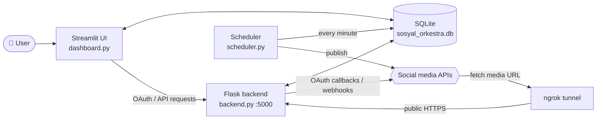

<div align="center">

# 🎻 Sosyal Orkestra

**A self-hosted social media management tool: plan, schedule, auto-publish and report on every account from one dashboard.**

Facebook · Instagram · LinkedIn · Pinterest · Google Business Profile · X (Twitter)


*Türkçe okumak için: [README.tr.md](README.tr.md)*

</div>

---

## 📖 What is it?

**Sosyal Orkestra** ("social orchestra") is an open-source alternative to hosted social media schedulers, for agencies and businesses that run several brands. Accounts connect through each platform's **official API and OAuth**. Posts go onto a calendar, and a scheduler publishes them automatically when they are due. Everything runs on your own machine or server.

> **Interface language:** the dashboard is currently in Turkish. Translation contributions are very welcome.

## ✨ Features

| | Feature | What it does |
|---|---|---|
| 🗓️ | **Content calendar** | Plan posts on a calendar. Due posts are checked every minute and published automatically. |
| 🏷️ | **Multiple brands** | Several brands under one team, each with its own accounts, posts and content. |
| 👥 | **Teams & permissions** | Per-member permissions: `post`, `approve`, `view reports`, `manage team`. |
| ✅ | **Approval workflow** | Posts drafted by editors are not published until someone with approval rights signs off. |
| 🤖 | **AI-assisted content** | Captions and content ideas with OpenAI, plus automatic image alt text for accessibility. |
| 📥 | **Unified inbox** | Sync comments from the platforms, then reply to and like them from the dashboard. |
| 📊 | **Analytics & PDF reports** | Charts by platform and over time, a best-time-to-post analysis, and one-click PDF reports. |
| 🔭 | **Competitor tracking** | Track competitor accounts' follower counts over time. |
| 💡 | **Trends** | Trending searches from Google Trends. |
| 🖼️ | **Image tools** | Search Unsplash images and crop uploads. |
| 📤 | **Bulk upload** | Schedule dozens of posts at once from a CSV template. |
| #️⃣ | **Templates & hashtag groups** | Save and reuse captions and hashtag sets. |
| 🪣 | **Content buckets** | Group posts into categories such as Promotion or Campaign. |
| 🔔 | **Notifications** | An in-app notification for every post that is published or fails. |
| 🔐 | **Security** | Hashed passwords, two-factor authentication (TOTP), Fernet encryption for tokens. |

## 🌐 Platform support

| Platform | Connect account | Auto-publish | Notes |
|---|:---:|:---:|---|
| **Facebook** (Pages) | ✅ | ✅ | Image posts. Video publishing is not implemented yet. |
| **Instagram** (Business) | ✅ | ✅ | Images and video (Reels). |
| **LinkedIn** | ✅ | ✅ | Text posts only for now. |
| **Pinterest** | ✅ | ✅ | Pins to a chosen board. |
| **Google Business Profile** | ✅ | ✅ | Posts to a business location. |
| **X (Twitter)** | ✅ | ⏳ | Connection and inbox work; scheduled publishing is not added yet. |

> Post statistics on the per-platform performance panel currently use **sample (mock) data**. Real API statistics are on the roadmap.

## 🏗️ Architecture

`run.py` starts four services with a single command:



| Component | Role |
|---|---|
| `dashboard.py` | Streamlit UI: login, calendar, reports, settings |
| `backend.py` | Flask server: OAuth login and callbacks, webhooks, inbox, trends and report endpoints, media serving |
| `scheduler.py` | Finds due posts every minute and publishes them to the right platform |
| `database.py` | SQLite schema and all database access |
| `platforms/` | One publishing class per platform, each derived from `BasePlatform` |
| `security.py` | Fernet encryption for sensitive data |
| `ngrok_utils.py` | Finds the HTTPS address of the running ngrok tunnel |
| `pdf_utils.py` | Builds PDF reports from analytics data |

> **Why ngrok?** Instagram, Pinterest and Google download the image to publish from a public URL themselves. ngrok exposes the local Flask server (`/uploads/...`) to the internet, and doubles as the OAuth callback address.

## 🚀 Getting started

### Requirements

- Python 3.10+
- [ngrok](https://ngrok.com/download), installed and linked to your account with `ngrok config add-authtoken <token>`
- Developer apps for the platforms you want to use (Meta, LinkedIn, Pinterest, Google, X)

### 1. Clone

```bash
git clone https://github.com/ahmettasdemirusa/sosyalorkestra.git
cd sosyalorkestra
```

### 2. Virtual environment and dependencies

```bash
python -m venv venv
source venv/bin/activate      # Windows: venv\Scripts\activate
pip install -r requirements.txt
```

### 3. Create a `.env` file

Add a `.env` file to the project root. You only need keys for the platforms you use.

```env
# --- General ---
FLASK_SECRET_KEY=a-long-random-value
ENCRYPTION_KEY=                      # Generated on first run if empty; paste the printed value here
BACKEND_URL=https://xxxx.ngrok-free.app   # run.py fills this in; used as a fallback if ngrok is not running

# --- Meta (Facebook + Instagram) ---
FACEBOOK_APP_ID=
FACEBOOK_APP_SECRET=
FACEBOOK_WEBHOOK_VERIFY_TOKEN=

# --- X (Twitter) ---
TWITTER_API_KEY=
TWITTER_API_SECRET_KEY=

# --- LinkedIn ---
LINKEDIN_CLIENT_ID=
LINKEDIN_CLIENT_SECRET=

# --- Pinterest ---
PINTEREST_APP_ID=
PINTEREST_APP_SECRET=

# --- Google (Business Profile) ---
GOOGLE_CLIENT_ID=
GOOGLE_CLIENT_SECRET=
GOOGLE_DEVELOPER_TOKEN=

# --- AI and images ---
OPENAI_API_KEY=
UNSPLASH_ACCESS_KEY=
```

> ⚠️ `.env` is in `.gitignore`. Never commit your keys.

### 4. Register callback URLs in each platform app

Add your ngrok address to each developer app's redirect/callback URL field:

| Platform | Callback URL |
|---|---|
| Facebook | `https://<your-ngrok-host>/callback/facebook` |
| Instagram | `https://<your-ngrok-host>/callback/instagram` |
| X (Twitter) | `https://<your-ngrok-host>/callback/x` |
| LinkedIn | `https://<your-ngrok-host>/callback/linkedin` |
| Pinterest | `https://<your-ngrok-host>/callback/pinterest` |
| Google Business Profile | `https://<your-ngrok-host>/callback/google_my_business` |

For the Meta app, also set:

- **Webhook:** `https://<your-ngrok-host>/webhook/facebook`
- **Data deletion request:** `https://<your-ngrok-host>/facebook/data-deletion`
- **Privacy policy:** `https://<your-ngrok-host>/privacy-policy`
- **Terms of service:** `https://<your-ngrok-host>/terms-of-service`

> 💡 On ngrok's free plan the address changes on every start. A static ngrok domain saves you from updating the callbacks each time.

### 5. Run

```bash
python run.py
```

This starts **ngrok → Flask backend → scheduler → Streamlit UI**, in that order. The dashboard opens at `http://localhost:8501`. Press `Ctrl + C` in the terminal to stop every service.

On first launch, create a user account. Then add your first brand under **Settings → Brand Management** and connect your accounts from **Platform Management**.

<details>
<summary><b>Running the services separately (for development)</b></summary>

Run each command in its own terminal:

```bash
ngrok http 5000
python backend.py
python scheduler.py
streamlit run dashboard.py
```

</details>

## 📤 Bulk upload format

Download the template from the **Bulk Upload** page and fill it in. Each row is one post:

```csv
platform_name,account_name,caption,media_path,scheduled_datetime,bucket_name
Instagram,Your Account,"This is a sample post. #bulkupload","uploads/sample.jpg","2024-12-25 10:30:00",Promotion
Facebook,Your Page,"Another post.","uploads/another_image.png","2024-12-26 18:00:00",
```

Media files must already be in the project's `uploads/` folder.

## 📁 Project structure

```
sosyalorkestra/
├── run.py                  # Starts every service with one command
├── dashboard.py            # Streamlit UI
├── backend.py              # Flask API, OAuth and webhooks
├── scheduler.py            # Scheduled post publisher
├── database.py             # SQLite schema and queries
├── security.py             # Fernet encryption helpers
├── ngrok_utils.py          # Finds the ngrok address
├── pdf_utils.py            # PDF report generation
├── requirements.txt
├── platforms/
│   ├── base_platform.py    # Base class for every platform
│   ├── facebook_platform.py
│   ├── instagram_platform.py
│   ├── linkedin_platform.py
│   ├── pinterest_platform.py
│   ├── google_my_business_platform.py
│   └── google_platform.py  # Google Ads / Analytics (draft)
└── uploads/                # Uploaded media (not tracked by git)
```

### Adding a new platform

1. Create a class in `platforms/` that inherits from `BasePlatform` and implements `post()`.
2. Add the `/login/<platform>` and `/callback/<platform>` flow in `backend.py`.
3. Add the platform's branch to `check_and_post_due_posts()` in `scheduler.py`.

## 🗺️ Roadmap

- [ ] English interface (i18n)
- [ ] Scheduled publishing for X (Twitter)
- [ ] Facebook video publishing
- [ ] LinkedIn image posts
- [ ] Real platform statistics instead of sample data
- [ ] Google Ads and Google Analytics integration (`google_platform.py`)
- [ ] Automatic renewal of expiring tokens
- [ ] Retry for failed posts

Contributions are welcome, especially translations and new platform integrations.

## 🔐 Security notes

- User passwords are hashed with Werkzeug and never stored as plain text.
- Two-factor authentication (Google Authenticator etc.) can be turned on from **Settings**.
- If `FLASK_SECRET_KEY` is not set, an insecure default is used. Always set it in production.
- `backend.py` runs in development mode (`debug=True`). Use a WSGI server such as `gunicorn` in production.

## 📄 License

[MIT](LICENSE). You are free to use, change and distribute the code; just keep the license and copyright notice.

---

<div align="center">

If this project is useful to you, a ⭐ helps other people find it.

Built by **[Ahmet Tasdemir](https://github.com/ahmettasdemirusa)** · [ahmettasdemir.com](https://ahmettasdemir.com)

</div>
