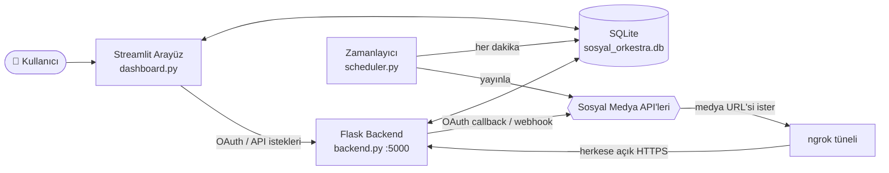

<div align="center">

# 🎻 Sosyal Orkestra

**Tüm sosyal medya hesaplarınızı tek bir panelden yönetin, planlayın ve raporlayın.**

Facebook · Instagram · LinkedIn · Pinterest · Google My Business · X (Twitter)


</div>

---

## 📖 Nedir?

**Sosyal Orkestra**, ajansların ve işletmelerin birden fazla markayı ve sosyal medya hesabını tek bir yerden yönetmesi için geliştirilmiş bir sosyal medya yönetim panelidir. Hesaplar resmî API'ler ve OAuth ile bağlanır; gönderiler takvime yerleştirilir, zamanı geldiğinde zamanlayıcı tarafından otomatik olarak yayınlanır.

## ✨ Özellikler

| | Özellik | Açıklama |
|---|---|---|
| 🗓️ | **İçerik Takvimi** | Gönderileri takvim üzerinde planlayın; zamanı gelen gönderiler her dakika kontrol edilip otomatik yayınlanır. |
| 🏷️ | **Çoklu Marka** | Bir takım altında birden fazla marka; her markanın kendi hesapları, gönderileri ve içerikleri. |
| 👥 | **Takım ve Yetkiler** | Üye bazında `paylaşım`, `onaylama`, `rapor görme` ve `takım yönetimi` izinleri. |
| ✅ | **Onay Akışı** | Editörlerin hazırladığı gönderiler, yetkili bir kişi onaylamadan yayınlanmaz. |
| 🤖 | **Yapay Zekâ Destekli İçerik** | OpenAI ile gönderi metni ve içerik fikri üretimi, görseller için otomatik alt metin (erişilebilirlik). |
| 📥 | **Birleşik Gelen Kutusu** | Yorumları platformlardan senkronize edin, panelden yanıtlayın ve beğenin. |
| 📊 | **Analiz ve PDF Rapor** | Platform ve zamana göre gönderi grafikleri, en iyi paylaşım saati analizi, tek tıkla PDF rapor. |
| 🔭 | **Rakip Analizi** | Rakip hesapların takipçi değişimini zaman içinde izleyin. |
| 💡 | **Trendler** | Google Trends üzerinden Türkiye gündemindeki aramalar. |
| 🖼️ | **Görsel Araçları** | Unsplash'ten görsel arama, yüklenen görseli kırpma. |
| 📤 | **Toplu Yükleme** | CSV şablonu ile onlarca gönderiyi tek seferde planlayın. |
| #️⃣ | **Şablonlar ve Hashtag Grupları** | Sık kullanılan metinleri ve hashtag setlerini kaydedip tekrar kullanın. |
| 🪣 | **İçerik Kovaları** | Gönderileri kategorilere (ör. Tanıtım, Kampanya) ayırın. |
| 🔔 | **Bildirimler** | Yayınlanan veya hata veren her gönderi için panel içi bildirim. |
| 🔐 | **Güvenlik** | Şifreler hash'lenerek saklanır, iki aşamalı doğrulama (TOTP / 2FA), token'lar için Fernet şifreleme. |

## 🌐 Platform Desteği

| Platform | Hesap Bağlama | Otomatik Yayın | Not |
|---|:---:|:---:|---|
| **Facebook** (Sayfa) | ✅ | ✅ | Görsel gönderi. Video yayını henüz yok. |
| **Instagram** (Business) | ✅ | ✅ | Görsel ve video (Reels). |
| **LinkedIn** | ✅ | ✅ | Şu an yalnızca metin gönderisi. |
| **Pinterest** | ✅ | ✅ | Seçilen panoya Pin. |
| **Google My Business** | ✅ | ✅ | İşletme konumuna gönderi. |
| **X (Twitter)** | ✅ | ⏳ | Bağlantı ve gelen kutusu hazır; zamanlayıcıdan yayın henüz eklenmedi. |

> Platform bazlı performans panelindeki gönderi istatistikleri şu an **örnek (mock) veri** ile gösterilmektedir; gerçek API istatistikleri yol haritasındadır.

## 🏗️ Mimari

`run.py` tek bir komutla dört servisi birlikte başlatır:



| Bileşen | Görevi |
|---|---|
| `dashboard.py` | Streamlit ile kullanıcı arayüzü: giriş, takvim, raporlar, ayarlar |
| `backend.py` | Flask sunucusu: OAuth giriş/callback, webhook'lar, gelen kutusu, trend ve rapor uç noktaları, medya sunumu |
| `scheduler.py` | Zamanı gelen gönderileri her dakika bulup ilgili platforma yayınlar |
| `database.py` | SQLite şeması ve tüm veritabanı işlemleri |
| `platforms/` | Her platform için `BasePlatform`'dan türeyen yayın sınıfları |
| `security.py` | Fernet ile hassas verilerin şifrelenmesi |
| `ngrok_utils.py` | Çalışan ngrok tünelinin HTTPS adresini bulur |
| `pdf_utils.py` | Analiz verisinden PDF rapor üretir |

> **Neden ngrok?** Instagram, Pinterest ve Google gibi platformlar, yayınlanacak görseli herkese açık bir URL'den kendileri indirir. ngrok, yerel Flask sunucusunu (`/uploads/...`) internete açarak bunu mümkün kılar ve OAuth callback adresi olarak da kullanılır.

## 🚀 Kurulum

### Gereksinimler

- Python 3.10+
- [ngrok](https://ngrok.com/download) (kurulu ve hesabınıza bağlı: `ngrok config add-authtoken <token>`)
- Kullanmak istediğiniz platformların geliştirici uygulamaları (Meta, LinkedIn, Pinterest, Google, X)

### 1. Projeyi indirin

```bash
git clone https://github.com/ahmettasdemirusa/sosyalorkestra.git
```

```bash
cd sosyalorkestra
```

### 2. Sanal ortam ve bağımlılıklar

```bash
python -m venv venv
```

Windows için:

```bash
venv\Scripts\activate
```

macOS / Linux için:

```bash
source venv/bin/activate
```

```bash
pip install -r requirements.txt
```

### 3. `.env` dosyasını oluşturun

Proje kök dizinine bir `.env` dosyası ekleyin. Yalnızca kullanacağınız platformların anahtarlarını doldurmanız yeterlidir.

```env
# --- Genel ---
FLASK_SECRET_KEY=uzun-ve-rastgele-bir-deger
ENCRYPTION_KEY=                      # Boş bırakılırsa ilk çalıştırmada üretilir, çıktıdaki değeri buraya yapıştırın
BACKEND_URL=https://xxxx.ngrok-free.app   # run.py bunu otomatik doldurur; ngrok çalışmazsa yedek olarak kullanılır

# --- Meta (Facebook + Instagram) ---
FACEBOOK_APP_ID=
FACEBOOK_APP_SECRET=
FACEBOOK_WEBHOOK_VERIFY_TOKEN=

# --- X (Twitter) ---
TWITTER_API_KEY=
TWITTER_API_SECRET_KEY=

# --- LinkedIn ---
LINKEDIN_CLIENT_ID=
LINKEDIN_CLIENT_SECRET=

# --- Pinterest ---
PINTEREST_APP_ID=
PINTEREST_APP_SECRET=

# --- Google (My Business) ---
GOOGLE_CLIENT_ID=
GOOGLE_CLIENT_SECRET=
GOOGLE_DEVELOPER_TOKEN=

# --- Yapay Zekâ ve Görseller ---
OPENAI_API_KEY=
UNSPLASH_ACCESS_KEY=
```

> ⚠️ `.env` dosyası `.gitignore` içindedir. Anahtarlarınızı asla depoya göndermeyin.

### 4. Platform uygulamalarında callback adreslerini tanımlayın

Her geliştirici uygulamasının "Redirect / Callback URL" alanına ngrok adresinizi ekleyin:

| Platform | Callback URL |
|---|---|
| Facebook | `https://<ngrok-adresiniz>/callback/facebook` |
| Instagram | `https://<ngrok-adresiniz>/callback/instagram` |
| X (Twitter) | `https://<ngrok-adresiniz>/callback/x` |
| LinkedIn | `https://<ngrok-adresiniz>/callback/linkedin` |
| Pinterest | `https://<ngrok-adresiniz>/callback/pinterest` |
| Google My Business | `https://<ngrok-adresiniz>/callback/google_my_business` |

Meta uygulaması için ayrıca:

- **Webhook:** `https://<ngrok-adresiniz>/webhook/facebook`
- **Veri silme isteği:** `https://<ngrok-adresiniz>/facebook/data-deletion`
- **Gizlilik politikası:** `https://<ngrok-adresiniz>/privacy-policy`
- **Kullanım koşulları:** `https://<ngrok-adresiniz>/terms-of-service`

> 💡 Ücretsiz ngrok planında adres her başlatmada değişir. Callback adreslerini her seferinde güncellememek için ngrok'tan sabit (static) bir alan adı almanız önerilir.

### 5. Çalıştırın

```bash
python run.py
```

Bu komut sırasıyla **ngrok → Flask backend → zamanlayıcı → Streamlit arayüz** servislerini başlatır. Arayüz varsayılan olarak `http://localhost:8501` adresinde açılır. Tüm servisleri durdurmak için terminalde `Ctrl + C` yeterlidir.

İlk açılışta bir kullanıcı hesabı oluşturun, ardından **Ayarlar → Marka Yönetimi** bölümünden ilk markanızı ekleyin ve **Platform Yönetimi** üzerinden hesaplarınızı bağlayın.

<details>
<summary><b>Servisleri ayrı ayrı çalıştırmak (geliştirme için)</b></summary>

Her komutu ayrı bir terminalde çalıştırın:

```bash
ngrok http 5000
```

```bash
python backend.py
```

```bash
python scheduler.py
```

```bash
streamlit run dashboard.py
```

</details>

## 📤 Toplu Yükleme Formatı

**Toplu Yükleme** sayfasından şablonu indirip doldurun. Her satır bir gönderidir:

```csv
platform_name,account_name,caption,media_path,scheduled_datetime,bucket_name
Instagram,Hesap Adiniz,"Bu bir örnek gönderidir. #topluyukleme","uploads/ornek.jpg","2024-12-25 10:30:00",Tanıtım
Facebook,Sayfa Adiniz,"Bu başka bir gönderi.","uploads/baska_bir_gorsel.png","2024-12-26 18:00:00",
```

Medya dosyaları önceden projenin `uploads/` klasöründe bulunmalıdır.

## 📁 Proje Yapısı

```
sosyalorkestra/
├── run.py                  # Tüm servisleri tek komutla başlatır
├── dashboard.py            # Streamlit arayüzü
├── backend.py              # Flask API, OAuth ve webhook'lar
├── scheduler.py            # Zamanlanmış gönderi yayıncısı
├── database.py             # SQLite şeması ve sorgular
├── security.py             # Fernet şifreleme yardımcıları
├── ngrok_utils.py          # ngrok adresini bulma
├── pdf_utils.py            # PDF rapor üretimi
├── requirements.txt
├── platforms/
│   ├── base_platform.py    # Tüm platformların temel sınıfı
│   ├── facebook_platform.py
│   ├── instagram_platform.py
│   ├── linkedin_platform.py
│   ├── pinterest_platform.py
│   ├── google_my_business_platform.py
│   └── google_platform.py  # Google Ads / Analytics (taslak)
└── uploads/                # Yüklenen medya (git'e dahil değil)
```

### Yeni bir platform eklemek

1. `platforms/` altında `BasePlatform`'dan türeyen bir sınıf oluşturup `post()` metodunu uygulayın.
2. `backend.py` içinde `/login/<platform>` ve `/callback/<platform>` akışını ekleyin.
3. `scheduler.py` içindeki `check_and_post_due_posts()` fonksiyonuna platformun dalını ekleyin.

## 🗺️ Yol Haritası

- [ ] X (Twitter) için zamanlanmış yayın
- [ ] Facebook video yayını
- [ ] LinkedIn görselli gönderi
- [ ] Örnek veriler yerine gerçek platform istatistikleri
- [ ] Google Ads ve Google Analytics entegrasyonu (`google_platform.py`)
- [ ] Süresi dolan token'ların otomatik yenilenmesi
- [ ] Hatalı gönderiler için yeniden deneme

## 🔐 Güvenlik Notları

- Kullanıcı şifreleri Werkzeug ile hash'lenir; düz metin saklanmaz.
- İki aşamalı doğrulama (Google Authenticator vb.) **Ayarlar** sayfasından açılabilir.
- `FLASK_SECRET_KEY` tanımlanmazsa güvensiz bir varsayılan kullanılır — canlı ortamda mutlaka ayarlayın.
- `backend.py` geliştirme modunda (`debug=True`) çalışır; canlı ortamda `gunicorn` gibi bir WSGI sunucusu kullanın.

## 📄 Lisans

Bu proje [MIT Lisansı](LICENSE) ile lisanslanmıştır. Kodu özgürce kullanabilir, değiştirebilir ve dağıtabilirsiniz; tek şart lisans ve telif bildiriminin korunmasıdır.

---

<div align="center">

Geliştiren: **[Ahmet Taşdemir](https://github.com/ahmettasdemirusa)**

</div>
